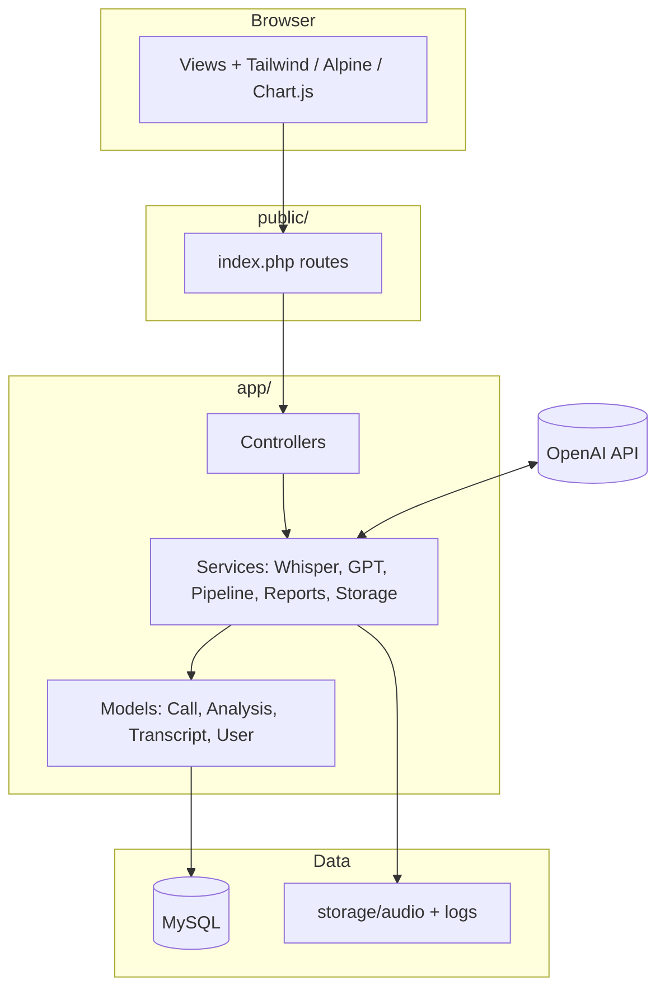

# Architecture & structure

High-level layout for **Architecture & structure** review.

## Request flow (call analysis)

1. **POST `/calls/upload`** → `CallController::store` → `FileStorageService` → DB row `uploaded`.
2. **Shutdown handler** → `CallPipelineService::process`:
   - `WhisperService::transcribe`
   - `Transcript::upsert`
   - `GPTAnalysisService::analyzeTranscript`
   - `Analysis::saveForCall` → status `complete`.

## Key boundaries

- **Controllers** — Auth, CSRF, HTTP only.
- **Services** — External APIs and orchestration.
- **Models** — SQL via PDO prepared statements.
